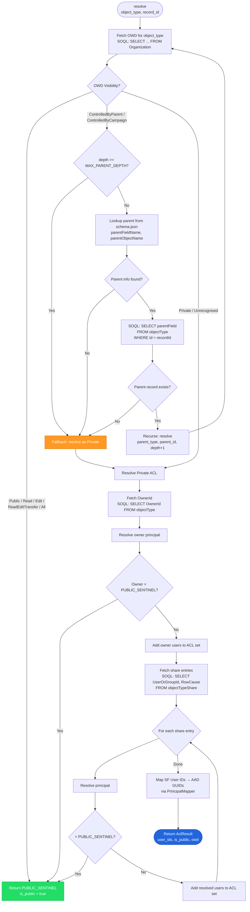
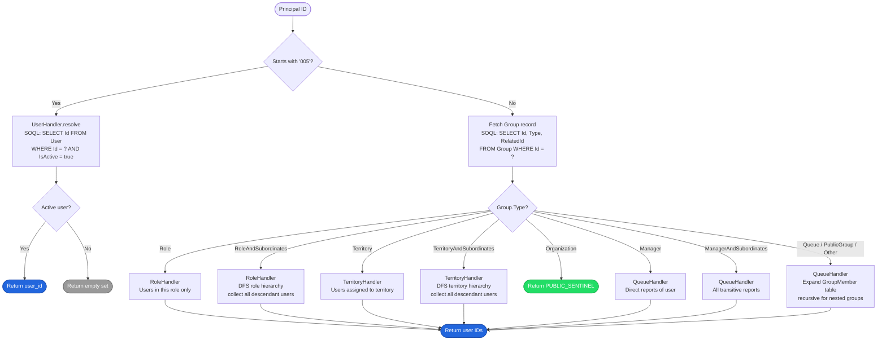
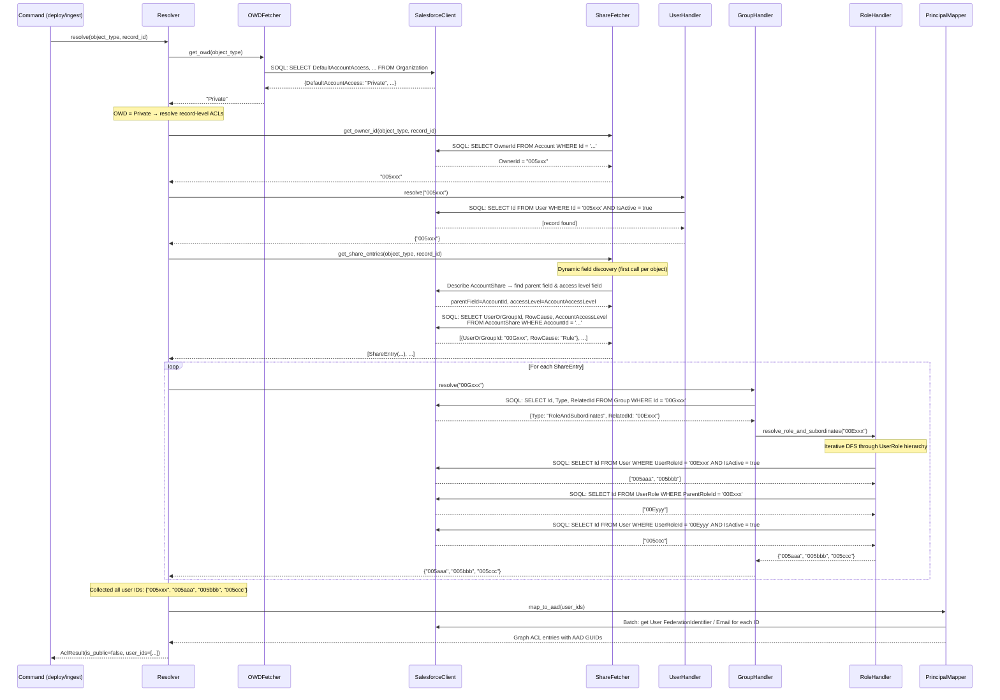
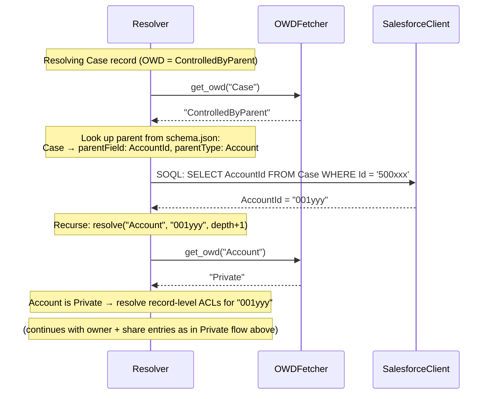
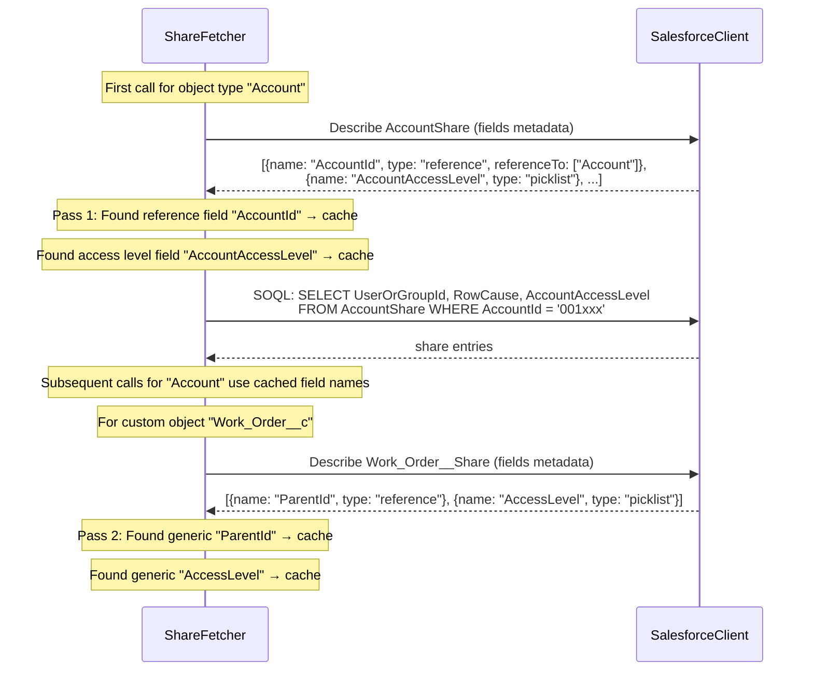

# ACL Engine

Orchestrates the complete **Access Control List (ACL) resolution pipeline** to determine which users should have access to each Salesforce record when surfaced in Microsoft Search.

## How It Works

The engine queries Salesforce sharing metadata and translates it into Microsoft Graph ACL entries:

1. **Org-Wide Defaults (OWD)** — Checks object-level visibility (`Public`, `Private`, `ControlledByParent`).
2. **Share Tables** — Queries `<Object>Share` tables for record-level sharing rules.
3. **Principal Expansion** — Expands sharing entries into individual user ACLs by resolving:
   - Direct user references
   - Roles and role-with-subordinates hierarchies
   - Territory-based sharing (Territory2)
   - Queues, public groups, and manager grants
4. **AAD Mapping** — Converts Salesforce User IDs to Azure AD GUIDs for Graph API compatibility.

---

## Flowchart — ACL Resolution Pipeline



---

## Flowchart — Principal Resolution (Type Dispatch)

When a principal ID is encountered (owner or share entry), it is routed to a specialised handler based on its type:



---

## Sequence Diagram — Full ACL Resolution for a Private Record



---

## Sequence Diagram — ControlledByParent (Recursive)



---

## Sequence Diagram — Share Table Dynamic Field Discovery



---

## Files

| File | Description |
|------|-------------|
| `__init__.py` | Package entry point; documents public API (`AclResolver`, `SalesforceClient`, `AclResult`). |
| `models.py` | Shared data classes and enums (`OWDVisibility`, `PUBLIC_SENTINEL`, `GroupType`, `ShareEntry`). |
| `resolver.py` | Main orchestrator coordinating all resolution steps. |
| `org_wide_defaults.py` | Fetches and interprets Org-Wide Default visibility settings (single cached query). |
| `share_fetcher.py` | Queries `<Object>Share` tables with dynamic field discovery and caching. |
| `user_handler.py` | Validates individual User principals (005-prefix IDs) checking `IsActive`. |
| `group_handler.py` | Dispatches non-user principals to specialised handlers by `Group.Type`. |
| `role_handler.py` | Expands role-based groups using iterative DFS on `UserRole` hierarchy. |
| `territory_handler.py` | Resolves Territory2-based sharing with hierarchy traversal. |
| `queue_handler.py` | Handles queues, public groups, managers, and org-wide grants. |
| `salesforce_client.py` | Thin async REST client for SOQL queries, pagination, and sObject describe. |
| `principal_mapper.py` | Converts Salesforce User IDs into Graph-API-ready ACL entries with AAD GUID resolution. |
| `identity_models.py` | Data models for identity crawl and group ACL (`EntityVisibility`, `SfUser`, `SfGroup`, `GroupIdentityType`). |
| `group_id_formats.py` | Canonical format strings for external group IDs (shared by identity crawl and group ACL builder). |
| `identity_queries.py` | SOQL query methods for identity crawl (authorized users, role hierarchy, shares, frozen users, etc.). |
| `group_acl_builder.py` | Group-based ACL builder: produces ACLs referencing external groups instead of individual users. |
| `identity_sync.py` | Identity Crawl handler: creates/populates external groups in Microsoft Graph. |

## Usage

The engine supports three ACL resolution modes, controlled by environment variables:

| Environment Variable | Value | ACL Mode | Description |
|---------------------|-------|----------|-------------|
| *(default)* | — | **Legacy** | User-only ACL via `graph/legacy_acl_resolver.py` |
| `USE_NEW_ACL_ENGINE` | `true` | **New (user-only)** | Modular user-only ACL via `acl_engine/resolver.py` + `PrincipalMapper` |
| `USE_GROUP_ACL` | `true` | **Group-based** | Group-reference ACLs via `acl_engine/group_acl_builder.py` (requires identity crawl) |

### User-only ACL (existing)

```python
from acl_engine import AclResolver
resolver = AclResolver(config, client)
acl_map = await resolver.resolve(records_by_object_type)
```

### Group-based ACL (new)

```python
from acl_engine import GroupAclBuilder
builder = GroupAclBuilder(sf_client, owd_overrides=config.owd_overrides, parent_map=config.parent_map)
acl_map = builder.resolve(records_by_object_type)
```

## Key Decision Points

| Scenario | Behaviour |
|----------|-----------|
| OWD = Public/Read/Edit | Short-circuit → everyone has access |
| OWD = ControlledByParent | Recursively resolve parent record (max depth 5) |
| OWD = Private | Query owner + share table, expand all principals |
| Principal starts with `005` | Direct user validation (check `IsActive`) |
| Group.Type = Organization | Short-circuit → `PUBLIC_SENTINEL` (everyone) |
| Group.Type = RoleAndSubordinates | DFS through `UserRole.ParentRoleId` hierarchy |
| Parent not found during recursion | Fallback to Private ACL resolution |
| Max parent depth exceeded | Fallback to Private ACL resolution |
