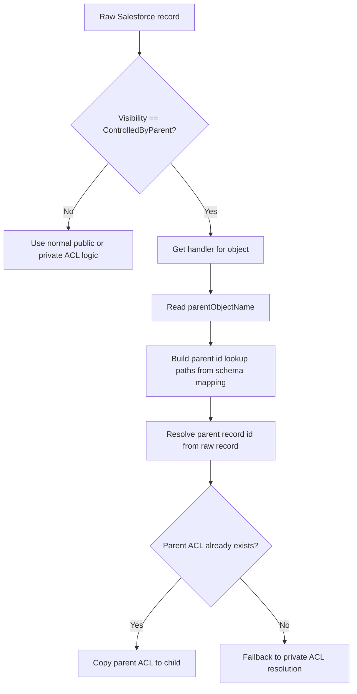

# Schema-Driven ACL Parent Child Inheritance

This note explains how parent-child ACL inheritance works in the live connector code under `python_connector/connector/*`.

It focuses on the relationship between:

- `connector/references/schema.json`
- `connector/item_converter.py`
- `connector/acl.py`

## Summary

The live ACL inheritance logic is now schema-driven.

That means ACL inheritance follows the same parent-child intent defined in `schema.json` that the item converter already uses.

This is different from the older behavior, which effectively assumed an `AccountId`-based inheritance shortcut.

## What The Schema Provides

The file `connector/references/schema.json` tells the live connector:

- which object is a child
- which object is its parent
- which Salesforce field on the child points to the parent

Example child definition:

```json
{
  "objectName": "Contact",
  "selectedFields": {
    "Account.Id": "AccountId",
    "Name": "Name"
  },
  "parentObjectName": "Account",
  "objectNameAsChild": "Contacts"
}
```

Important fields:

- `parentObjectName`
- `selectedFields`
- `objectNameAsChild`

## How The Converter Uses It

In `connector/item_converter.py`, each `SalesforceObjectHandler` stores:

- `object_name`
- `parent_object_name`
- `object_name_as_child`

The converter uses this metadata to understand object relationships when building items.

## How ACL Now Uses The Same Metadata

The ACL resolver now reads the same handler metadata instead of assuming the parent is always found through raw `AccountId`.

The main logic is:

1. build handlers from `schema.json`
2. when an object's visibility is `ControlledByParent`, look up that object's handler
3. read `handler.parent_object_name`
4. find the parent record id in the raw Salesforce record using schema-derived lookup paths
5. copy the already-built parent ACL if available
6. if no parent id or no parent ACL is found, fall back to private ACL resolution

## Parent Id Lookup Rules

The handler derives parent lookup paths from `selectedFields`.

If the parent is `Account`, ACL will try paths in this style:

- raw field mapped to `AccountId`, for example `Account__c`
- raw field `AccountId`
- nested field `Account.Id`

This means a child can inherit from its parent even when the raw Salesforce field is custom, as long as the schema maps it to the canonical property name.

## Flow



## Example 1: Contact Inherits From Account

Schema:

```json
{
  "objectName": "Contact",
  "selectedFields": {
    "Account.Id": "AccountId"
  },
  "parentObjectName": "Account"
}
```

Raw Salesforce record:

```json
{
  "Id": "003-contact",
  "Account": {
    "Id": "001-account"
  }
}
```

Behavior:

- ACL sees `Contact` is `ControlledByParent`
- handler says parent is `Account`
- handler resolves parent id from `Account.Id`
- ACL copies the ACL from Account `001-account`

## Example 2: Custom Child Field Still Inherits

Schema:

```json
{
  "objectName": "Project__c",
  "selectedFields": {
    "Account__c": "AccountId"
  },
  "parentObjectName": "Account"
}
```

Raw Salesforce record:

```json
{
  "Id": "a01-project",
  "Account__c": "001-account"
}
```

Behavior:

- ACL resolves the parent id using `Account__c`
- because the schema mapped it to `AccountId`
- the child inherits Account ACL correctly

## Example 3: Dependency Ordering

If schema says:

- `Account` is parent of `Project__c`
- `Project__c` is parent of `Task__c`

the ACL resolver now sorts objects by parent dependency depth before building ACL maps.

That ensures:

- Account ACL is built first
- Project ACL is built second
- Task ACL is built third

so child inheritance can work reliably.

## Important Limitation

This inheritance path only applies when Salesforce visibility for the child object is `ControlledByParent`.

If the object visibility is public or private, ACL still follows the normal branches in `connector/acl.py`.

## Practical Rule For Customers Editing schema.json

If a customer wants child objects to inherit ACL from a parent object, they should ensure:

1. the child object includes `parentObjectName`
2. the child object exposes the parent reference in `selectedFields`
3. that parent reference maps to the canonical property name `<ParentObjectName>Id`

Examples:

- `Account.Id -> AccountId`
- `AccountId -> AccountId`
- `Account__c -> AccountId`
- `Project__c -> Project__cId`

## Code Locations

- `connector/item_converter.py`: handler metadata and schema-driven parent lookup
- `connector/acl.py`: parent-controlled ACL inheritance
- `tests/test_acl_parent_mapping.py`: regression coverage for nested and custom parent fields